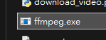

# discord-video-preview

A discord bot that generates preview from video posted.

# Usage

1. Download and install dependencies
2. Download [ffmpeg](https://github.com/BtbN/FFmpeg-Builds/releases) inside the file  
    example for windows:
   
3. Rename `.env.example` to `.env` and fill in the discord token
4. Run it! `python3 bot.py`
